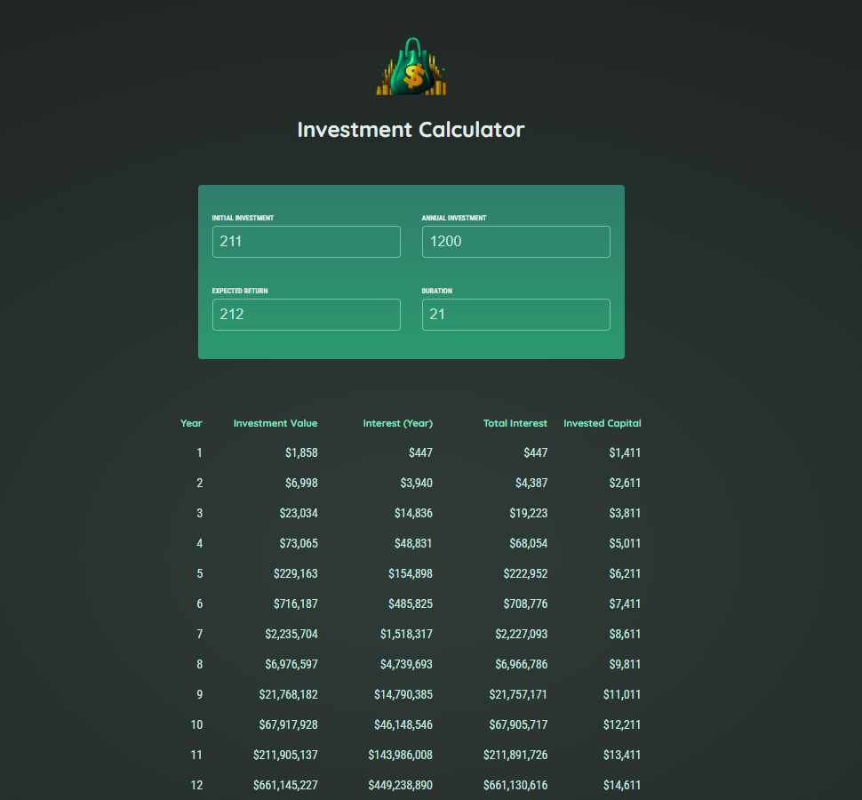

<div align="center">


# 💰 Investment Calculator

Simule a evolução do seu investimento ano a ano, com juros compostos e aportes anuais.




</div>

---

## ✨ Funcionalidades

- 🧮 **Quatro campos:** investimento inicial, aporte anual, retorno esperado (% ao ano) e duração (anos)
- ⚡ **Atualização instantânea:** a tabela é recalculada a cada tecla digitada
- 📊 **Projeção ano a ano:** valor do investimento, juros do ano, juros acumulados e capital investido
- 🛡️ **Validação da duração:** com duração menor que 1, a tabela some e aparece uma mensagem de orientação
- 💵 **Valores em moeda:** formatados em dólar (USD), sem casas decimais

## 🚀 Como rodar

Pré-requisito: [Node.js](https://nodejs.org/) 18 ou superior.

```bash
git clone https://github.com/vitorcgo/InvestmentCalculatorApp.git
cd InvestmentCalculatorApp
npm install
npm run dev
```

Depois, abra o endereço que o Vite mostrar no terminal (normalmente `http://localhost:5173`).

| Comando           | O que faz                             |
| ----------------- | ------------------------------------- |
| `npm run dev`     | Inicia o servidor de desenvolvimento  |
| `npm run build`   | Gera a versão de produção em `dist/`  |
| `npm run preview` | Serve localmente o build de produção  |
| `npm run lint`    | Verifica o código com o ESLint        |

## 🧠 Como o cálculo funciona

A cada ano, os juros incidem sobre o saldo acumulado, e o aporte anual entra em seguida:

```
juros do ano    = saldo × (retorno esperado / 100)
saldo final     = saldo + juros do ano + aporte anual
```

Exemplo com os valores padrão (10.000 iniciais, 1.200 por ano, 6% ao ano):

| Ano | Valor do investimento | Juros (ano) | Juros acumulados | Capital investido |
| --- | --------------------- | ----------- | ---------------- | ----------------- |
| 1   | $11,800               | $600        | $600             | $11,200           |
| 10  | $33,725               | $1,841      | $11,725          | $22,000           |

## 🗂️ Estrutura do projeto

```
src/
├── App.jsx                 # Guarda o estado dos campos e valida a duração
├── components/
│   ├── Header.jsx          # Logo e título
│   ├── UserInput.jsx       # Os quatro campos de entrada
│   └── Results.jsx         # Tabela com a projeção
└── util/
    └── investment.js       # Cálculo dos resultados e formatação em moeda
```

## ✅ Testes manuais

- [x] Ao iniciar, os quatro campos mostram 10000, 1200, 6 e 10
- [x] A tabela começa com 10 linhas e cinco colunas
- [x] Alterar investimento inicial, aporte e taxa muda os resultados
- [x] Duração 1 gera uma linha; duração 5 gera cinco
- [x] Duração 0 esconde a tabela e mostra a orientação
- [x] Voltar a duração para 10 restaura os resultados
- [x] Nenhum erro no console nem aviso de `key`

---

<div align="center">

Feito com ⚛️ por [Vitor](https://github.com/vitorcgo)

</div>
